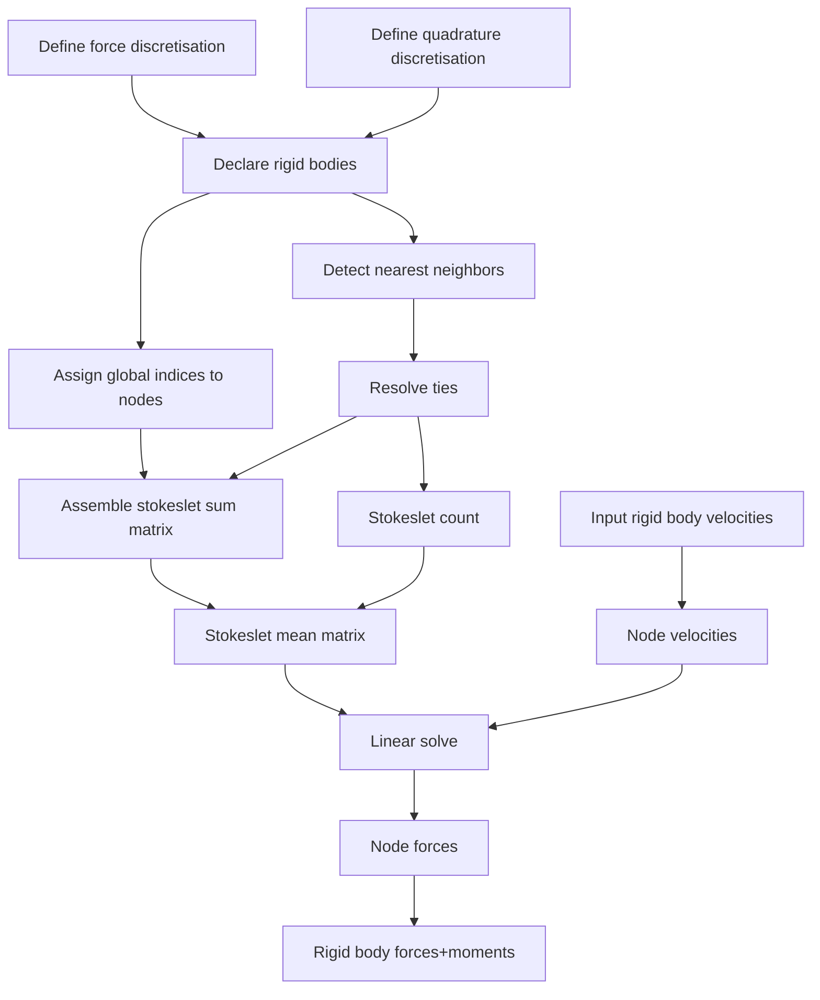

Workflow
==============

```mermaid
  flowchart TD
    
   rigid[Declare rigid bodies]
   force[Define force discretisation]
   quad[Define quadrature discretisation]
   index[Assign global indices to nodes]
   neigh[Detect nearest neighbors]
   ties[Resolve ties]
   matrix[Assemble stokeslet sum matrix]
   count[Stokeslet count]
   scale[Stokeslet mean matrix]
   bodyspeeds[Input rigid body velocities]
   speeds[Node velocities]
   solve[Linear solve]
   forces[Node forces]
   bodyforces[Rigid body forces+moments]


   force --> rigid
   quad  --> rigid; 
   rigid --> index; 
   rigid --> neigh; 
   neigh --> ties; 
   index --> matrix;
   ties --> matrix;
   ties --> count;
   count --> scale;
   speeds --> solve;
   matrix --> scale;
   scale --> solve;
   solve --> forces;
   bodyspeeds --> speeds;
   forces --> bodyforces
```